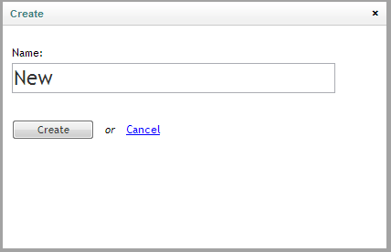
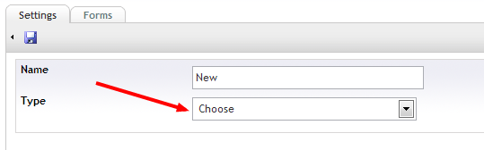
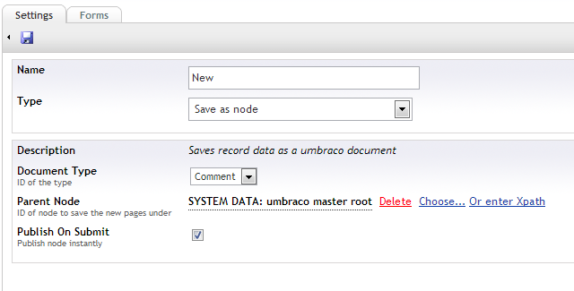
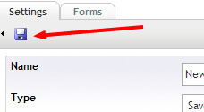
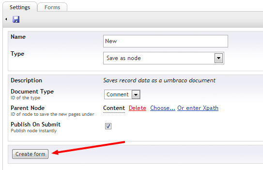
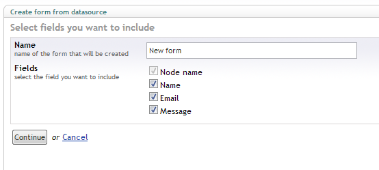
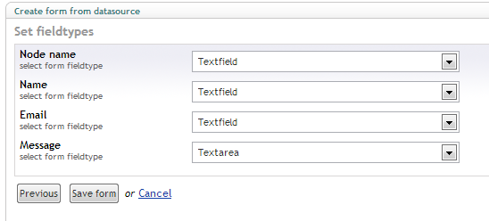
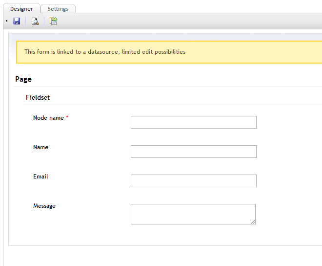

#Creating forms based on data sources
It's possible to automaticly create forms based on a data source (like an sql database table) that will also post record data to that source. All that's needed is to follow a wizard and your form will be autogenerated and hooked up to the specified source.

##Setting up a datasource
Datasource are managed in the datasource part of the Contour section

###Create new datasource
Right click the data sources tree and select create, a new modal should popup, provide a name for the new datasource

###Select type
Now the edit data source page should load, where you'll have to select a type, overview of the different default types can be found [below](#Overviewofthedefaultdatasourcetypes).

###Specify type specific settings
Depending on the chosen type you'll have to supply additional settings

In this case I am using the save as node type and want to create new documents of the type comment under my master root

###Save datasource

Once the settings are supplied save the datasource by hitting the save button in the toolbar, the settings will be validated 

##Creating form based on datasource

If the settings are valid you should be able to create a new form based on the datasource (by hitting the new button found at the bottom of the page)

###Select fields to include

First you'll get an overview of the available fields on the datasource, here you'll be able to chose wich ones to include on the form

###Select fieldtype of the fields

Next you'll need to map the fields to a fieldtype

###Create the form
You should now be taken to the newly created form that is linked to the datasource, be aware that this form will be placed in limited editing mode

##Overview of the default data source types
###Save as node
Saves record data as a umbraco document

###SQL database
Connects to any OLEDB supported Database Table and constructs a datasource from it

###Umbraco site
Connects to an umbraco website and uses a specific node and document type as storage

###Webservice
Sends records to any Webservice with WSDL support
