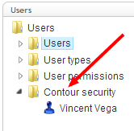
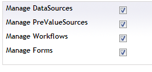
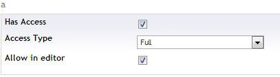

#Setting-up user security

If a user has access to the Contour section you can finetune what actions the users will be able to perform.

These security settings can be managed in the users section of Umbraco, for each user that has access to Contour you'll get a node in the Contour Security part of the users section

By default if a user is an administrator he will have access to everything, if it's an editor he won't have access...

##Global settings

###Manage data sources
Determines if a user can manage form data sources (so create new ones, edit and delete existing ones). If this is disabled the data sources tree will be unavailable

###Manage prevalue sources
Determines if a user can manage form prevalue sources (so create new ones, edit and delete existing ones). If this is disabled the prevalue sources tree will be unavailable

###Manage Workflows
Determines if a user can manage form workflows (so create new ones, edit and delete existing ones). If this is disabled the workfow node under a form won't appear.

###Manage Forms
Determines if a user can manage forms (create new ones, edit and delete existing ones)

##Form specific settings
Besides the global settings there are also settings that can be set for each individual form

###Has access
Determines if the user will be able to access to form

###Access type
The type of access a user has

####Full
User can change design and form settings, view and export entries
####Read only, view and export entries
User can't change design or settings but can view and export entries
####Read only, view entries
User can't change design or settings but can only view entries (and not export entries)

###Allow in editor
Determines if the form will be part of the forms that are allowed to be inserted in Umbraco's rich text editor.
