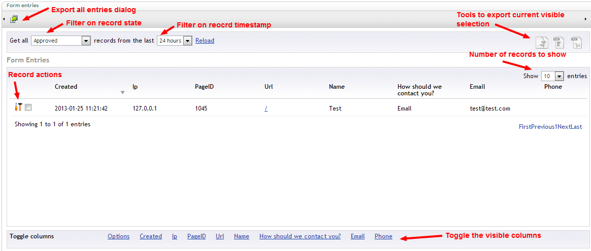
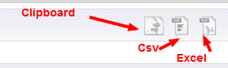
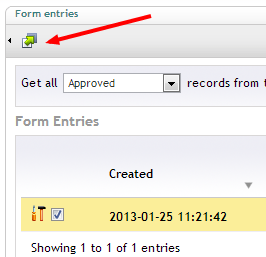
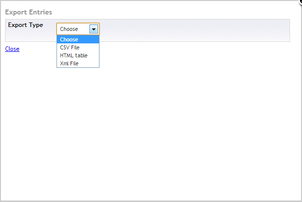
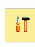
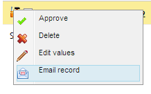
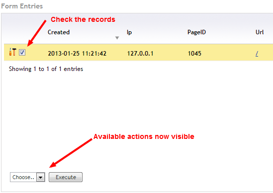
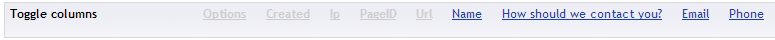

#Viewing and exporting entries

The entries viewer for each form can be found when expanding the form in the tree

##Overview

When accessing the entries viewer you should get a screen similar to

##Filtering

By default you'll see the approved record of the last 24 hours, if you want to change this simply update the filter settings

##Exporting visible selection

It's possible to export the entries that are currently visible

There are 3 options available 

- Clipboard
- Csv
- Excel

##Exporting complete record data

Besides to option to export the current selection you can also export all of the submitted records for your form. Hit the export button in the toolbar to open the export dialog.

Then in the dialog simply select the format of the export

The options are

- CSV File
- Html Table
- Xml File

##Individual record actions

Besides viewing the record data you can also perform several actions on a record, to show the available actions hit the tools icon on the left of the record line

Hitting the icon will display the available actions

By default the actions are:

- Approve
- Delete 
- Edit values
- Email record

###Approve

Will place the record in the approve state (only makes sense if the record isn't already in this state, like when you have manual approve on the form settings set to true)

###Delete

Deletes the record from the database (not possible to undo)

###Edit

Makes it possible to edit the record, will open up a new window where you wil see the form with the prepopulated with the record vales.
###Email

Makes it possible to send the record as an email

##Bulk record actions

Besides individual record actions it's also possible to execute actions on multipe records at the same time. Simply select the records by checking them (a checkbox is available for each record, next to the tools icon on the left).

After checking at least 1 record you should see the available actions popup at the bottom left.
By default there are 2 possible actions:

- Approve
- Delete

###Approve

Will place the records in the approve state
###Delete

Deletes the records from the database (not possible to undo)

##Toggling visible fields

The last tool you have available on the records viewer is to toggle the visible columns. By default all will be visible but if you want to hide certain columns from the current view just click the corresponding link in the toggle columns row.

