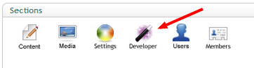
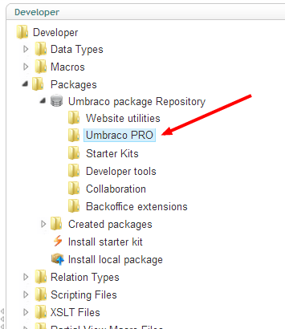
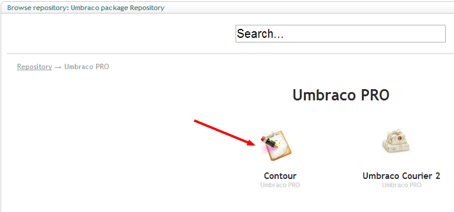
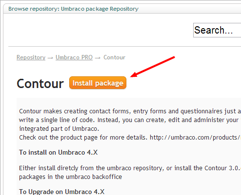
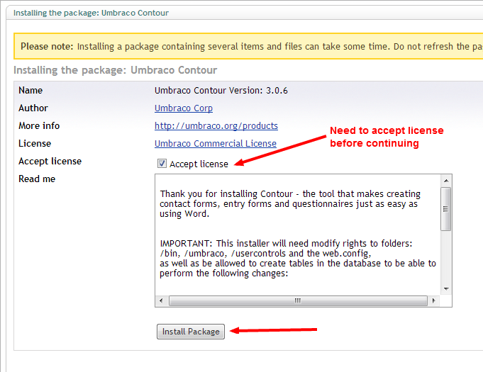
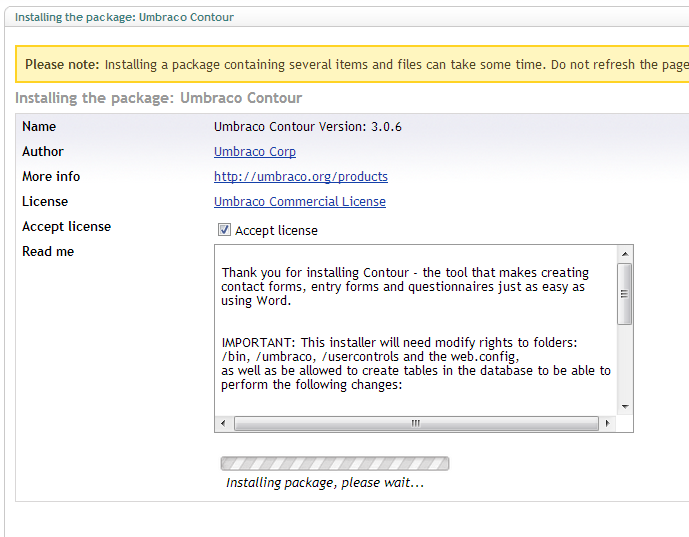
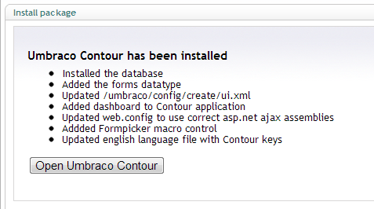
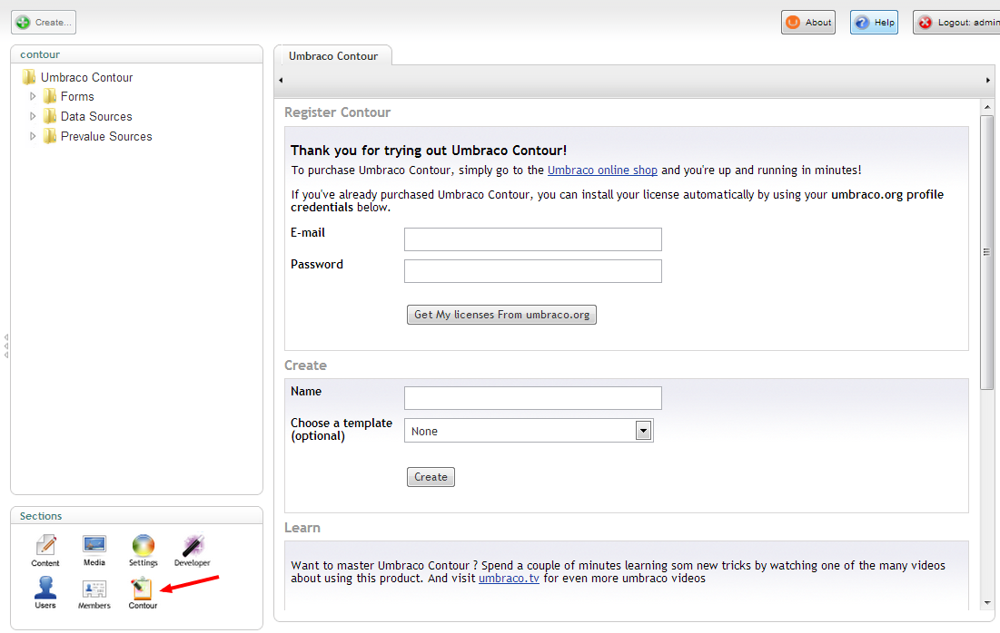

#Installation

It's easy to extend Umbraco with the Contour form builder section it just takes a few simple steps.

##Move to the developer section
In order to install Contour you'll need access to the developer section of your Umbraco instance

##Move to Packages/Umbraco Package Repo/Umbraco Pro
Expand the packages tree, then expand the umbraco package repo node and select Umbraco Pro

##Select Contour

Click on the Contour icon

##Click 'Install package'

To start with the installation hit the 'install package' button

##Accept license and continue with installation

You'll need to check the accept license checkbox before proceeding with the installation

##Wait for the installation to complete

Install may take a few moments so be patient while the necessary actions are happening

##Installation status

Once the installation has completed you should see an overview of the different items that have happened

If there where errors during installation you should see them here (more details on how to troubleshoot these can be found [here](troubleshoot.md)).

##Start using Contour

Hitting the 'Open Umbraco Contour' button will move you to the new section and you should be ready to [start designing forms](../Editor/Creating-a-Form/index.md). Notice that there is a new icon in the Sections part of the backoffice.

