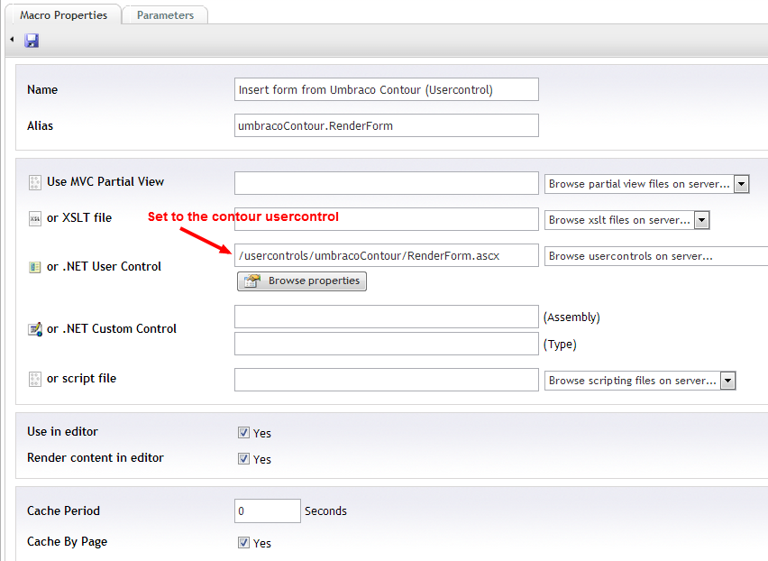
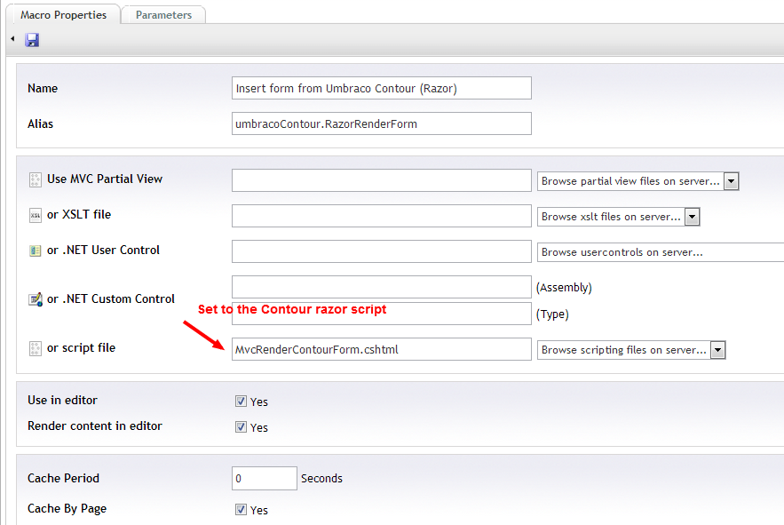
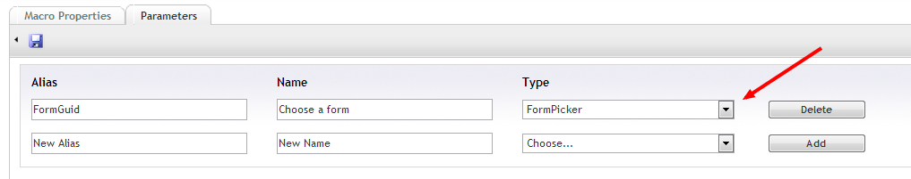

#Manual Contour installation

If for some reason the package installation fails or due to permissions or other reasons is not an option onyour system, we provide a manual installation process.

The manual process consists of 2 files:

-  Files.zip (*archive containing all files contour needs*)
-  CreateDBEngine.sql (*file containing the database tables install script*)

##Fetching the files
The most recent manual installation files can always be found on the [Contour project page](https://our.umbraco.com/projects/umbraco-pro/contour). Browse the page untill you see the Package files, there look for the file UmbracoContour_X.X.X_Manual_Install.zip where X.X.X is the current stable Contour version.

##Installing the files

Simply unzip the files.zip to the root of your website, the archive follows the structure needed to place the
files correctly. Notice: the archive assumes your umbraco director is located at /umbraco. if not you will
need to move those files manually to the right location.

If you have purchased Umbraco Contour, you can download a license file on umbraco.org. This license file
must be placed in the websites /bin directory to be registered

##Installing the database

To install the database we need to execute a sql script against the database umbraco is installed on.
Contour currently supports SQL server (from version 2005), SQL CE and MySQL.

###SQL server
- Download the [create script](resources/createsqlserver.md)
- Open Microsoft Sql Server Management Studio and connect to your database.
- Right click your umbraco database and choose "new query"
- Copy the contents of the createSQLServer.txt to the query window
- Execute the script
- If any errors are displayed, check your permissions. The install script requires database owner
access, as it creates new tables.

###SQL CE

Create script for SQL CE is available [here](resources/createsqlce.md)

###MySQL

Create script for MySQL is available [here](resources/createmysql.md)

##Adding configuration to ui.xml

For the all Contour tree items Umbraco needs some information for its context menu and create dialogs.
These are located in /umbraco/config/create/ui.xml. Add the below xml to the createUI element
	
	<nodeType alias="forms">
		<header>Forms</header>
		<usercontrol>/plugins/umbracocontour/createform.ascx</usercontrol>
		<tasks>
			<create assembly="Umbraco.Forms.UI" type="Tasks.FormTasks" />
			<delete assembly="Umbraco.Forms.UI" type="Tasks.FormTasks" />
		</tasks>
	</nodeType>
	<nodeType alias="formdatasources">
		<header>Datasources</header>
		<usercontrol>/create/simple.ascx</usercontrol>
		<tasks>
			<create assembly="Umbraco.Forms.UI" type="Tasks.DataSourceTasks" />
			<delete assembly="Umbraco.Forms.UI" type="Tasks.DataSourceTasks" />
		</tasks>
	</nodeType>
	<nodeType alias="formprevaluesource">
		<header>Prevalue source</header>
		<usercontrol>/create/simple.ascx</usercontrol>
		<tasks>
			<create assembly="Umbraco.Forms.UI" type="Tasks.PrevalueSourceTasks" />
			<delete assembly="Umbraco.Forms.UI" type="Tasks.PrevalueSourceTasks" />
		</tasks>
	</nodeType>

##Adding the contour dashboard section
Contour comes with a dashboard, this must be added to the /config/dashboard.config file to function add
the below xml to the dashBoard element:

	<section>
		<areas>
			<area>contour</area>
		</areas>
		<tab caption="Umbraco Contour">
			<control>/umbraco/plugins/umbracocontour/formsdashboard.ascx</control>
		</tab>
	</section>
	<section>
		<areas>
			<area>default</area>
			<area>content</area>
		</areas>
		<tab caption="Contact Logs">
			<control>/usercontrols/dashboards/ContactForm_logs.ascx</control>
		</tab>
		<tab caption="Email a Friend Logs">
			<control>/usercontrols/dashboards/EmailAFriendForm_logs.ascx</control>
		</tab>
	</section>

##Adding the Contour Xslt Library
To work with the xslt methods in the xslt editor, you need to add a reference to the Contour Xslt Extension.
This is done in /config/xsltExtensions.config
Add the below xml to the XsltExtensions element:

	<ext assembly="/bin/Umbraco.Forms.Core" type="Umbraco.Forms.Library" alias="umbraco.contour">

##Adding the macros
There should be 2 macros (1 webforms version using a usercontrol and 1 mvc version using a razor script)

###Usercontrol macro
Called 'Insert form from Umbraco Contour (Usercontrol)' with the alias  'umbracoContour.RenderForm'. Set to allow and render in the RTE.

###Razor script macro
Called 'Insert form from Umbraco Contour (Razor)' with the alias 'umbracoContour.RazorRenderForm'. Set to allow and render in the RTE.

###Parameter
Both macros should have a single parameter with the name 'Choose a form' and alias 'FormGuid' of the type 'FormPicker'
 

