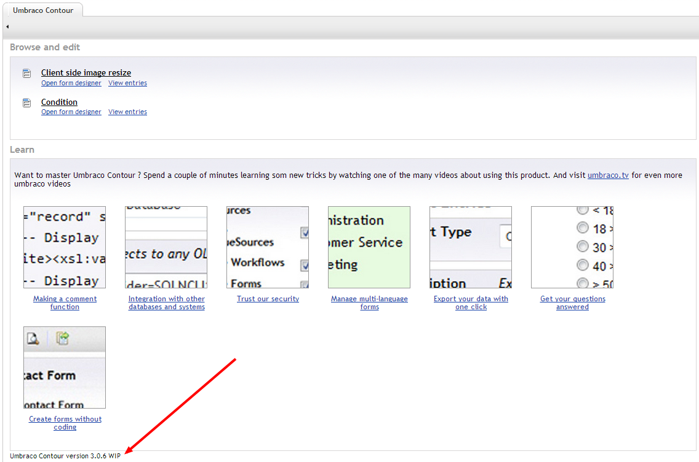

#Upgrading
Running an older version of Contour and want to upgrade, just follow these steps
##Checking the current installed version
The version number can be found at the bottom of the Contour dashboard.

If you don't see the version number you are definitly on an older version :) 
##Get the latest version
The latest stable version of Contour can always be found on the [project page](https://our.umbraco.com/projects/umbraco-pro/contour), to perform an upgrade you'll need to download the UmbracoContour_X.X.X_update.zip file (where X.X.X is the version number). An overview of what has changed can be found [here](http://nightly.umbraco.org/Umbraco%20Contour/changes.txt). Of course an update only makes sense if the current installed version is older then the latest version.

##Backup your site files
Just make sure you have a backup of your current site files before overwriting them. Everything should go smooth but you never know...

##Extract the archive and overwrite files
The downloaded archive contains all the files needed to perform an update, it isn't a package but a zip file with the new files. These new files need to be xcopied over the existing ones...

##Run the upgrade wizard
This only applies when moving from a 1.x version to a 3.x version. Since there are some db changes between these you'll need to update the database by requesting the following page mysite.com/umbraco/plugins/umbracocontour/upgrade.aspx 

##Clear browser cache
To make sure you are running the latest version of the javascript files make sure to clear your browser chache after performing an upgrade

